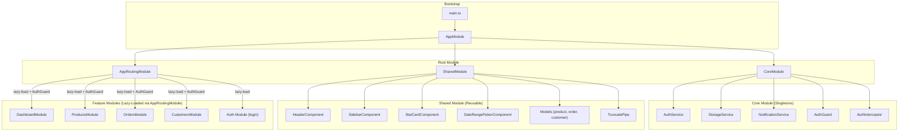
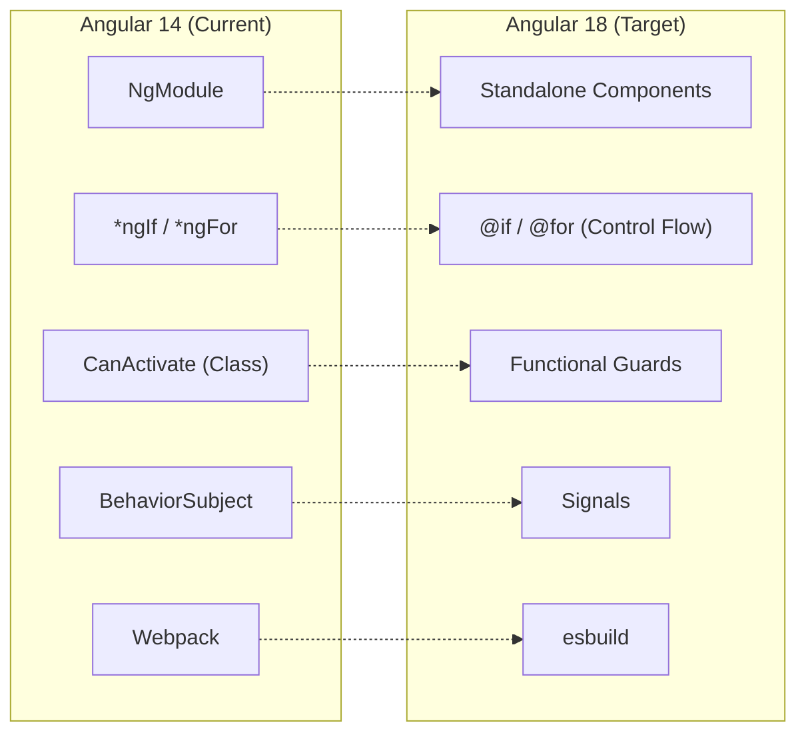

# RetailConnect — Angular 14 Migration Demo

## 1. Project Overview

RetailConnect is a store management portal built with **Angular 14** to demonstrate enterprise-level migration patterns from Angular 14 to Angular 18. It provides tools for managing products, tracking orders, and monitoring customer data in a retail environment. It uses `localStorage` for persistence (no backend required). The project intentionally uses legacy Angular patterns (`NgModule`, class-based guards, `BehaviorSubject` state management) to provide clear migration targets.

## 2. Tech Stack

| Category | Technology | Version |
|---|---|---|
| **Framework** | Angular | `^14.3.0` |
| **UI Library** | Angular Material | `^14.2.7` |
| **Reactive Programming** | RxJS | `~7.5.0` |
| **Build Tool** | Webpack via Angular CLI | `^14.2.13` |
| **Test Runner** | Karma / Jasmine | `~6.4.0` / `~4.2.0` |
| **Language** | TypeScript | `~4.7.2` |
| **Runtime** | Node.js | 16 (from `.nvmrc`) |

## 3. High-Level Architecture

The application follows a layered, modular architecture. `AppModule` is the root module bootstrapped via `main.ts`. It imports `CoreModule` (singleton services, guards, interceptors), `SharedModule` (reusable UI components, models, pipes), and lazy-loads all feature modules through `AppRoutingModule`. Every feature module except Auth is protected by `AuthGuard`.



## 4. Folder Structure

```
src/app/
├── core/
│   ├── guards/auth.guard.ts
│   ├── interceptors/auth.interceptor.ts
│   ├── services/
│   │   ├── auth.service.ts
│   │   ├── storage.service.ts
│   │   └── notification.service.ts
│   └── core.module.ts
├── shared/
│   ├── components/
│   │   ├── header/
│   │   ├── sidebar/
│   │   ├── stat-card/
│   │   └── date-range-picker/
│   ├── models/
│   │   ├── product.model.ts
│   │   ├── order.model.ts
│   │   └── customer.model.ts
│   ├── pipes/truncate.pipe.ts
│   └── shared.module.ts
├── features/
│   ├── auth/ (login component)
│   ├── dashboard/ (single component + module)
│   ├── products/ (product-list/, product-form/, services/)
│   ├── orders/ (order-list/, order-detail/, services/)
│   └── customers/ (customer-list/, services/)
├── app-routing.module.ts
├── app.component.ts / .html
└── app.module.ts
```

## 5. Key Functional Areas Breakdown

### Dashboard

- **Location:** `src/app/features/dashboard/`
- Single component providing real-time KPI tracking and recent activity summaries
- **Files:** `dashboard.component.ts/html/scss`, `dashboard.module.ts`, `dashboard-routing.module.ts`

### Products

- **Location:** `src/app/features/products/`
- Full CRUD operations for inventory management with stock level alerts
- **Sub-components:** `product-list/` (browse/search products), `product-form/` (add/edit products with reactive forms)
- Own `services/` directory for product data operations
- **Files:** `products.module.ts`, `products-routing.module.ts`

### Orders

- **Location:** `src/app/features/orders/`
- Order status management and date-filtered order history
- **Sub-components:** `order-list/` (browse/filter orders), `order-detail/` (view order details with status workflow)
- Own `services/` directory for order data operations
- **Files:** `orders.module.ts`, `orders-routing.module.ts`

### Customers

- **Location:** `src/app/features/customers/`
- Customer segmentation and spending analytics
- **Sub-components:** `customer-list/` (browse/analyze customers)
- Own `services/` directory for customer data operations
- **Files:** `customers.module.ts`, `customers-routing.module.ts`

## 6. Migration Goals (Angular 14 → 18)

| Pattern | Current (v14) | Target (v18) |
|---|---|---|
| Module system | `NgModule` | Standalone components |
| Template syntax | `*ngIf`, `*ngFor` | `@if`, `@for` |
| Route guards | `CanActivate` class | Functional guard |
| HTTP interceptors | Class-based | `withInterceptors()` |
| State | `BehaviorSubject` | Signals |
| Build | Webpack | esbuild |
| Tests | Karma / Jasmine | Jest |

### Feature Evolution

The following diagram maps current Angular 14 entities to their intended Angular 18 counterparts.



## 7. Local Development

```bash
npm install
npm start          # http://localhost:4200
```

Login with `admin@retailconnect.io` / `admin123`
