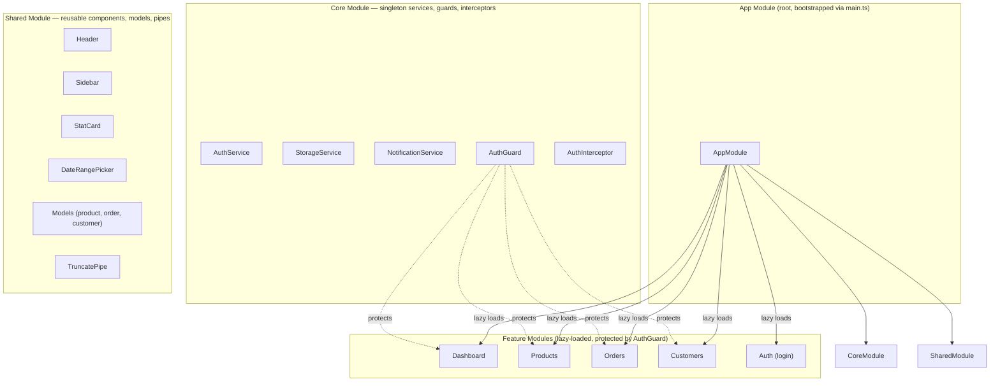

# RetailConnect — Store Management Portal

## Project Overview

RetailConnect is a store management portal built with Angular. It provides tools for managing products, tracking orders, and monitoring customer data in a retail environment. It uses localStorage for persistence (no backend required).

## Tech Stack

| Category | Technology | Version |
|---|---|---|
| **Framework** | Angular | `^14.3.0` |
| **UI Library** | Angular Material | `^14.2.7` |
| **Reactive Programming** | RxJS | `~7.5.0` |
| **Build Tool** | Webpack via Angular CLI | `^14.2.13` |
| **Test Runner** | Karma / Jasmine | `~6.4.0` / `~4.2.0` |
| **Language** | TypeScript | `~4.7.2` |
| **Runtime** | Node.js | 16 |

## High-Level Architecture



## Folder Structure

```
src/app/
├── core/
│   ├── guards/auth.guard.ts
│   ├── interceptors/auth.interceptor.ts
│   ├── services/
│   │   ├── auth.service.ts
│   │   ├── storage.service.ts
│   │   └── notification.service.ts
│   └── core.module.ts
├── shared/
│   ├── components/ (header, sidebar, stat-card, date-range-picker)
│   ├── models/ (product, order, customer)
│   ├── pipes/truncate.pipe.ts
│   └── shared.module.ts
├── features/
│   ├── auth/
│   ├── dashboard/
│   ├── products/ (product-list, product-form, services)
│   ├── orders/ (order-list, order-detail, services)
│   └── customers/ (customer-list, services)
├── app-routing.module.ts
├── app.component.ts/.html
└── app.module.ts
```

## Key Functional Areas

- **Dashboard:** KPI tracking and recent activity summaries (`src/app/features/dashboard/`)
- **Products:** CRUD for inventory with stock alerts; sub-components: product-list, product-form (`src/app/features/products/`)
- **Orders:** Order status management and date-filtered history; sub-components: order-list, order-detail (`src/app/features/orders/`)
- **Customers:** Customer segmentation and spending analytics; sub-component: customer-list (`src/app/features/customers/`)

## Local Development

### Dashboard

Login with `admin@retailconnect.io` / `admin123`
